# React-Native Weather App

Weather app that tells the user a basic condition of the weather, high and min temperature of the day, and current temperature based on their location.
  

  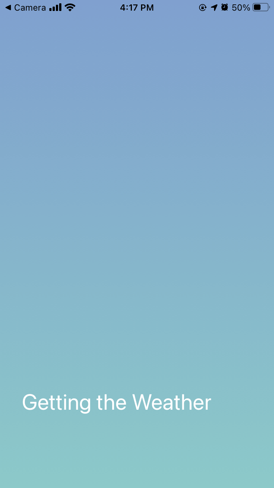
  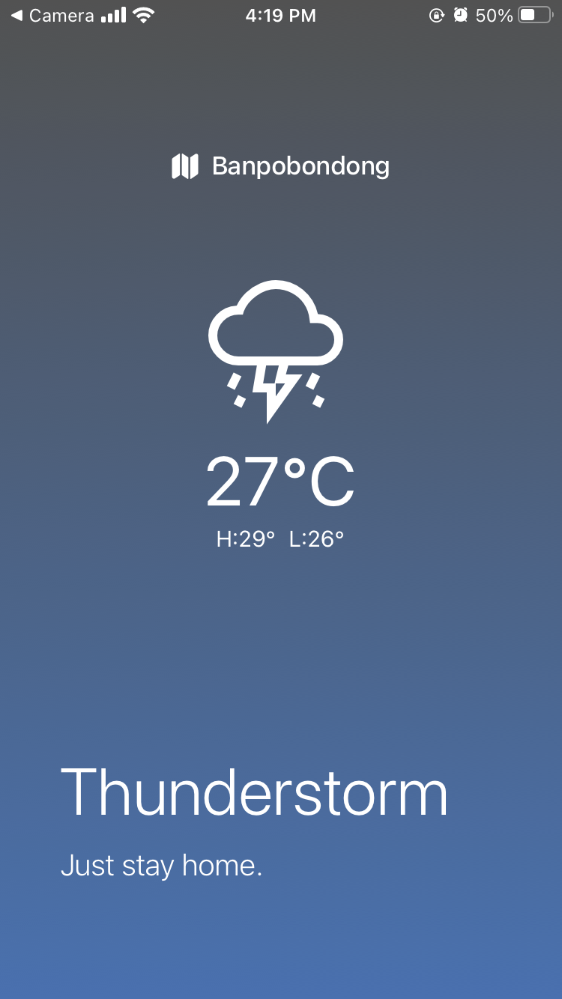
  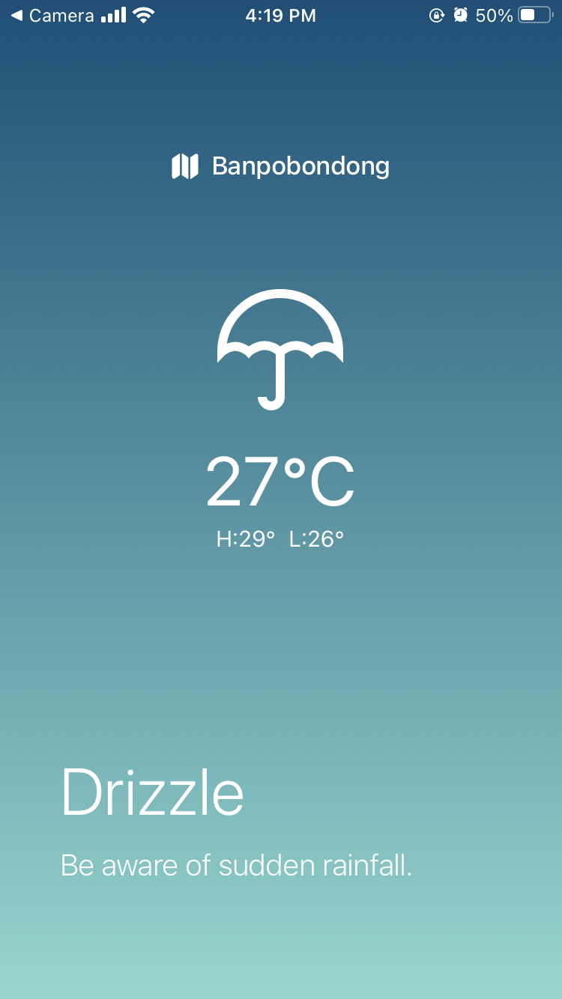
  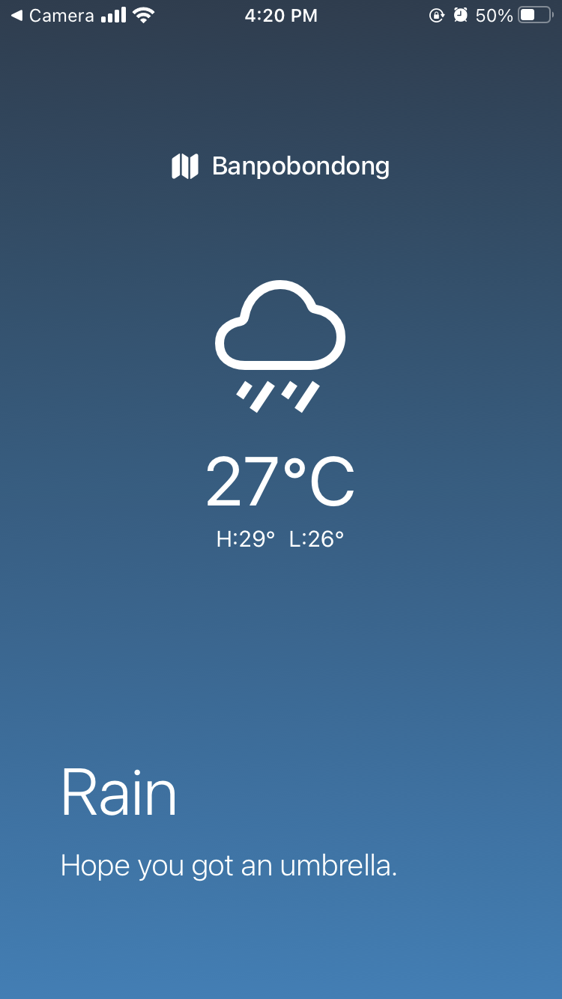
  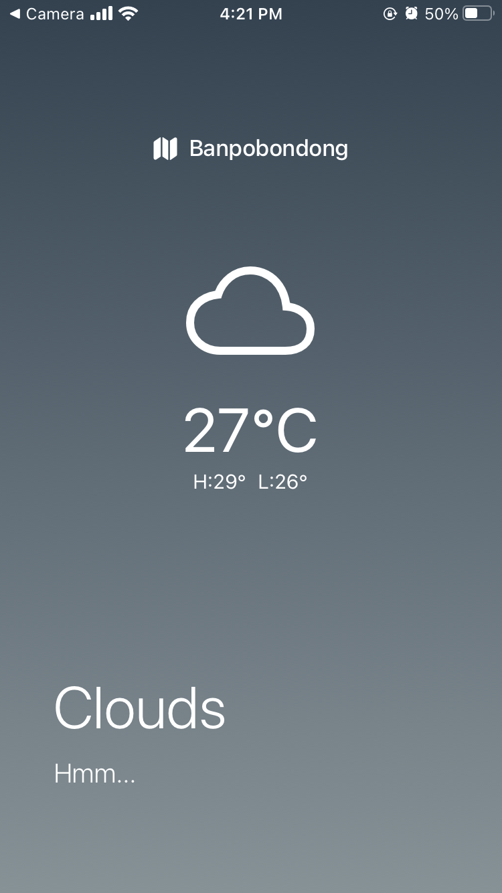
   
  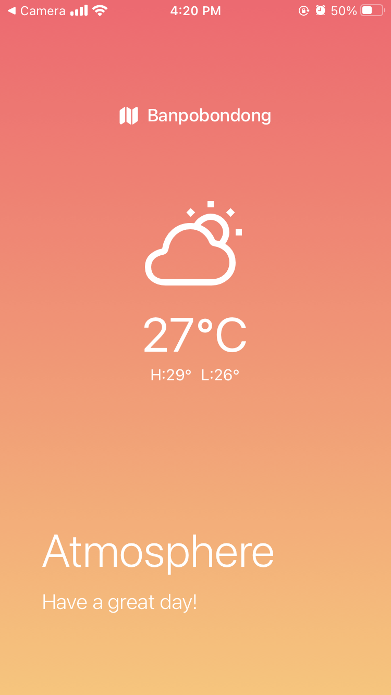
  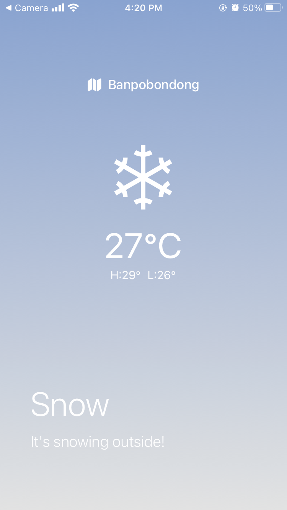
  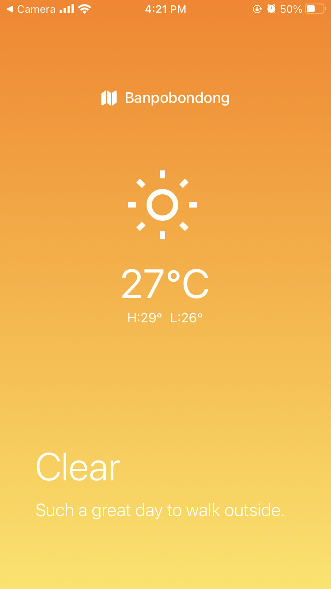
  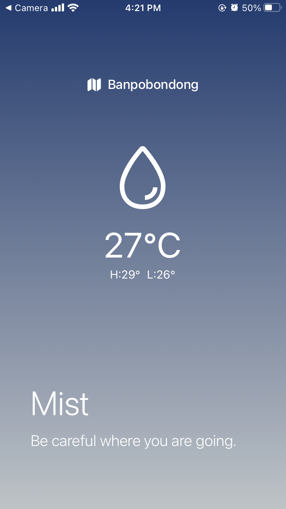
  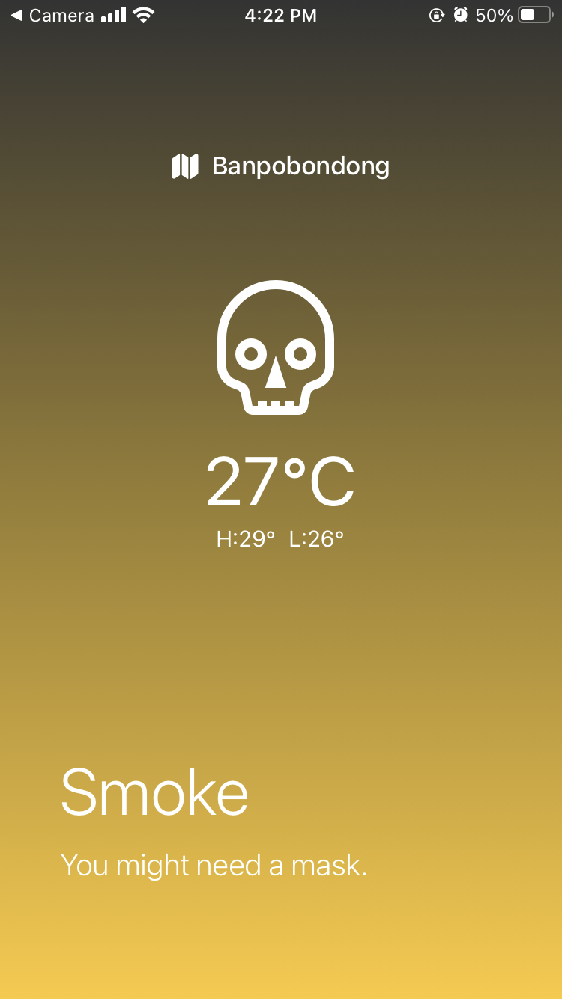
   
  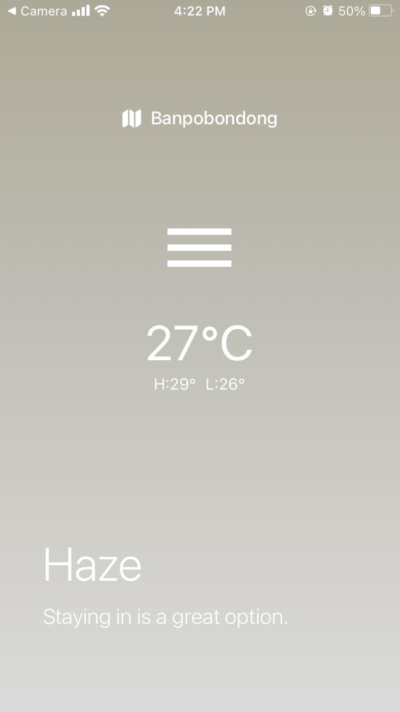
  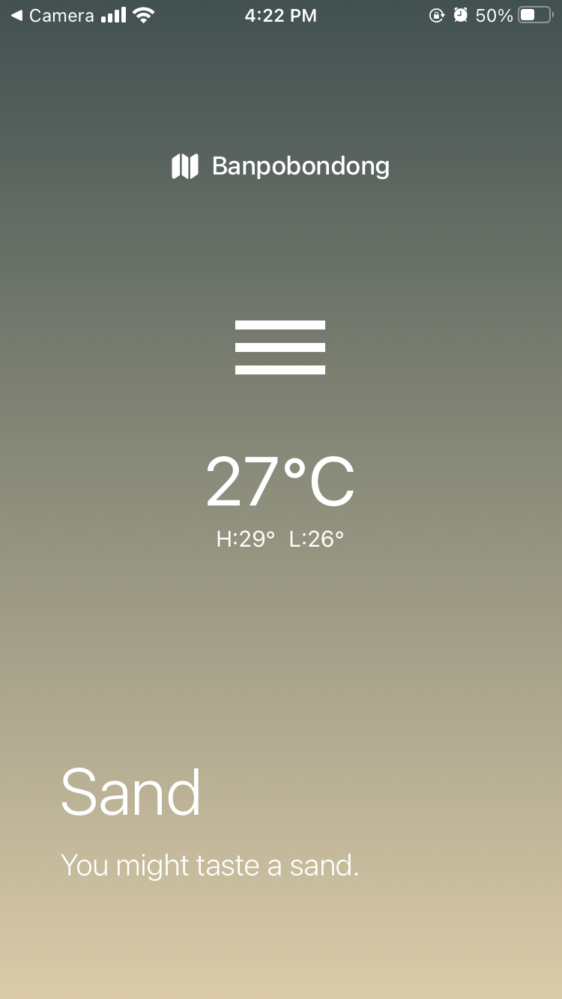
  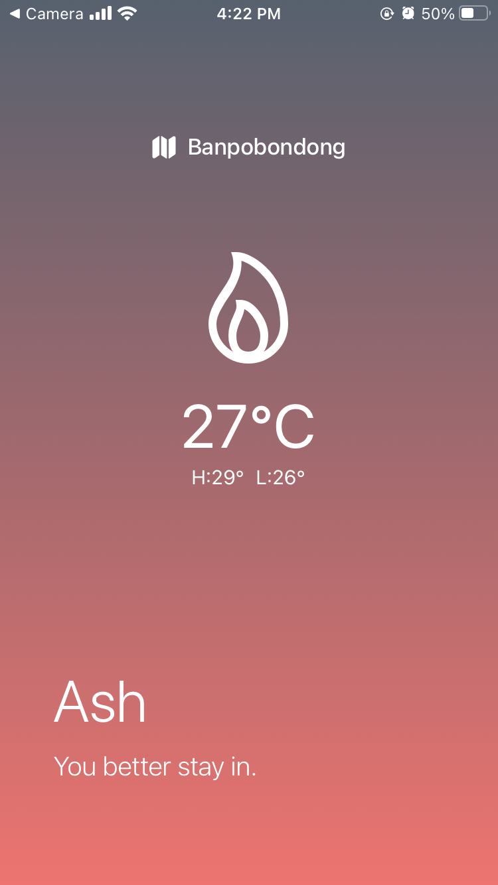
  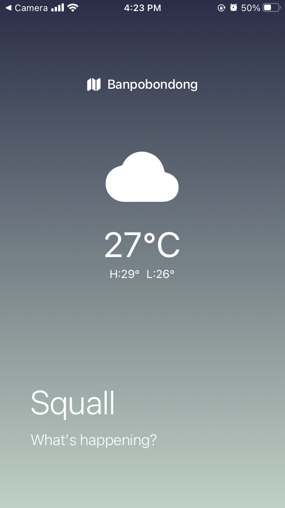
  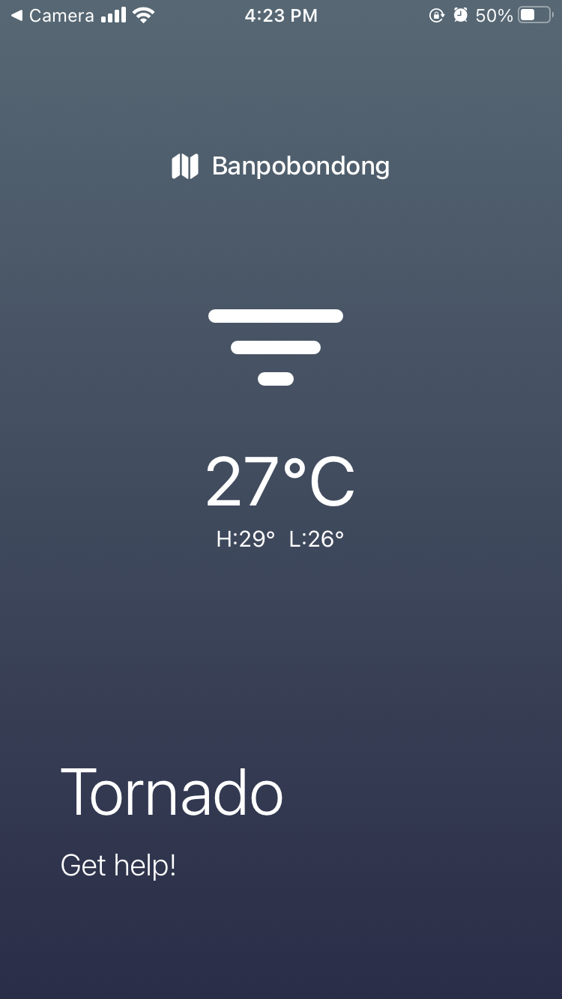

## Stack

### Front-end

 

## Packages

- React Native
- React
- Expo
- Axios

## Theory

- Expo
- React vs React Native
- Styles on React Native
- Font Icons
- Data Fetching
- Geolocation
- Permissions
